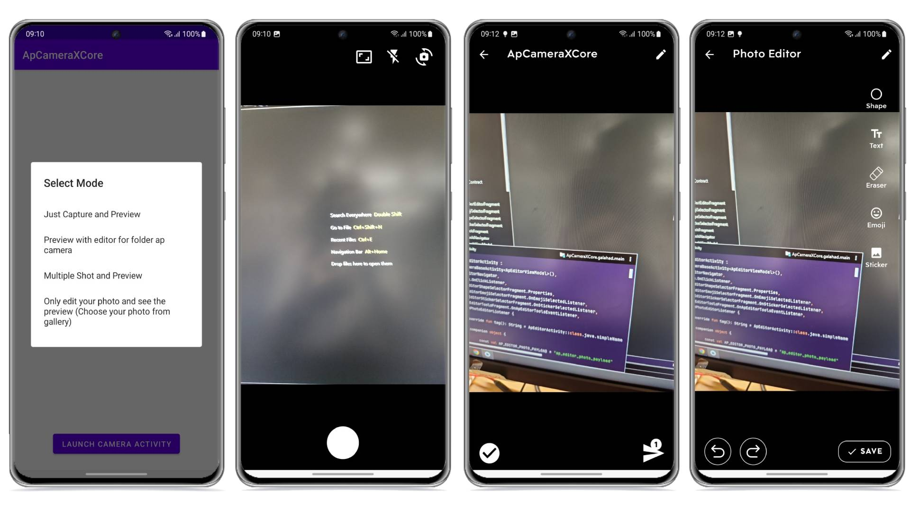

# AP_Camera_Core_Android




## LAST VERSION 1.1.4

- fixed bugs

## New Features

- Only edit your photo and see the preview (Choose your photo from gallery and in the future will be
  able to support url another )
##### use the new feature
```kotlin
    private val chooseGalleryActResultContract =
        registerForActivityResult(ActivityResultContracts.GetMultipleContents()) { rsList ->
            rsList?.let { uriList ->
                if (uriList.isNotEmpty()) {
                    if (rsList.isEmpty()) return@registerForActivityResult
                  
                  //Set up and start for launch AP Camera
                    val cameraBundle = Bundle().apply {
                        putInt(
                            ApCameraConst.ApCameraMode.AP_CAMERA_CONST_MODE_NAME,
                            ApCameraConst.ApCameraMode.AP_CAMERA_VAL_ONLY_EDIT_PHOTO_MODE
                        )
                        putStringArrayList(
                            ApCameraConst.ApCameraPayload.AP_CAMERA_INPUT_IMAGE_PATH_LIST_CONST_NAME,
                            rsList.map { it.toString() } as ArrayList<String>
                        )
                    }
                    apCameraContract.launch(cameraBundle)
                }
            }
        }
```
## How to use version 1.1.4

Create ActivityResultContract for ApCameraContract

```kotlin
val apCameraContract =
    registerForActivityResult(ApCameraContract("tag_name")) { imageUriStrResultList ->
        //imageUriStrResultList is type ArrayList<String>
        //result from AP Camera
    }
```

Create Bundle for launch

```kotlin
val cameraBundle = Bundle().apply {
    putInt(
        ApCameraConst.ApCameraMode.AP_CAMERA_CONST_MODE_NAME,
        ApCameraConst.ApCameraMode.AP_CAMERA_VAL_IS_ONLY_CAMERA_APC_MODE
    )
}
apCameraContract.launch(cameraBundle)
```

## Camera Mode

##### key value name

 ```
 ApCameraConst.ApCameraMode.AP_CAMERA_CONST_MODE_NAME
 ```

##### value for mode

```
ApCameraConst.ApCameraMode.AP_CAMERA_VAL_IS_ONLY_CAMERA_APC_MODE  is default simple mode. Just Capture and Preview
ApCameraConst.ApCameraMode.AP_CAMERA_VAL_VIEW_GALLERY_MODE  is capture and preview with editor and choose photo in gallery
ApCameraConst.ApCameraMode.AP_CAMERA_VAL_MULTIPLE_SHOT_PREVIEW_MODE  is Multiple Shot and Preview with editor
ApCameraConst.ApCameraMode.AP_CAMERA_VAL_ONLY_EDIT_PHOTO_MODE  is Only edit your photo and see the preview (Choose your photo from gallery and in the future will be able to support url another )
```

&copy; 2022 APThai
 
